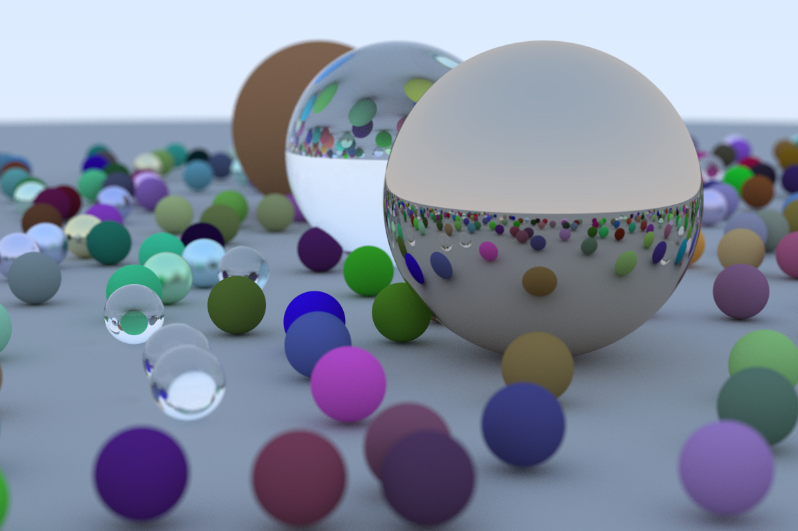
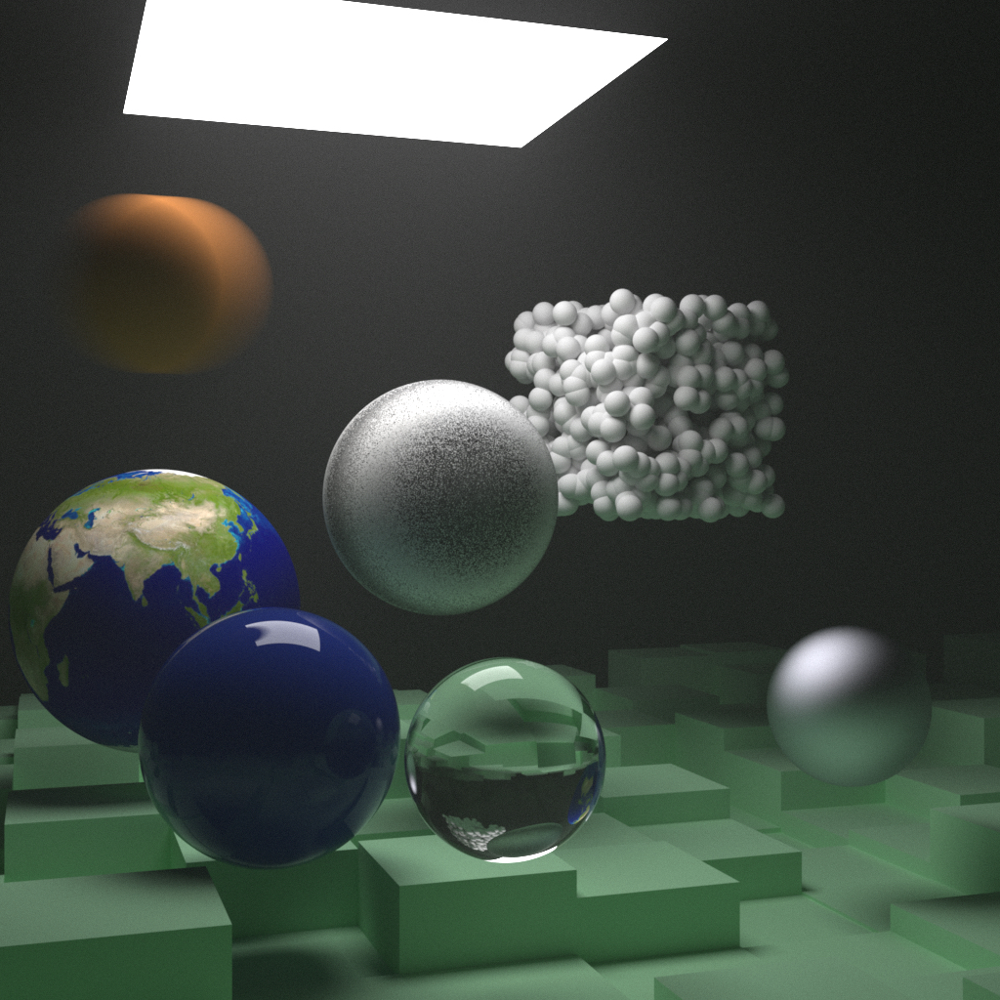

# ray tracing one week

A C++ project for learning ray tracing

Most code comes from [Ray Tracing in One Weekend](https://raytracing.github.io/books/RayTracingInOneWeekend.html)

Strictly follow the [Google C++ style guide](https://google.github.io/styleguide/cppguide.html)

## First week



## The next week



## Build

```bash
# Download the dependency for reading Jpeg file
git submodule update --init --recursive
# Using cmake to build
mkdir build
cd build
cmake ..
make
```

## Run

```bash
# Render the Random scene
./ray_tracing

# Render other scenes, you can find all the available scenes in the main.cpp
SCENE=Earth ./ray_tracing

# Modify the SPP to accelerate the processing
SPP=100 ./ray_tracing

# Calculate the PI
./pi

# Calculate the integration of X^2 from 0 to 2
./integrate_x
```

## Available scenes

- Random
- Random with Time
- Checker Texture
- Two Spheres
- Two Perlin Spheres
- Earth
- Simple Light
- Cornell Box
- Cornell Smoke
- The Next Week
