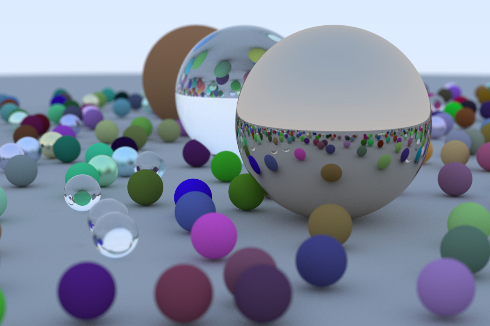

# ray tracing one week

A C++ project for learning ray tracing

Most code comes from [Ray Tracing in One Weekend](https://raytracing.github.io/books/RayTracingInOneWeekend.html)

Strictly follow the [Google C++ style guide](https://google.github.io/styleguide/cppguide.html)



## Build

```bash
mkdir build
cd build
cmake ..
make
```

## Run

```bash
./first_week
```